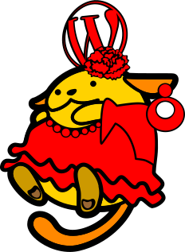
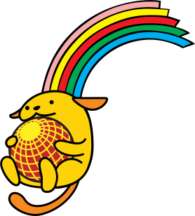

# WordPress Sevilla Wapuus

## WapuuPepe & WapuuPepa

 

Oficial wapuus of WordCamp Europe 2015.\
They were adopted by the WordPress Sevilla community and are still used.

* Author: Arantza Respaldiza
* Author website: https://marh.es/

## WapuuCurro

Official wapuu of WordCamp Sevilla 2023

* Author: Nilo Vélez
* Author website: https://www.nilovelez.com/

---

"わぷー(Wapuu)" is ja.wordpress.org official character. "わぷー(Wapuu)" was designed by [Kazuko Kaneuchi](http://blog.cgfm.jp/mutsuki/) under GPL v2 license or any later version.
